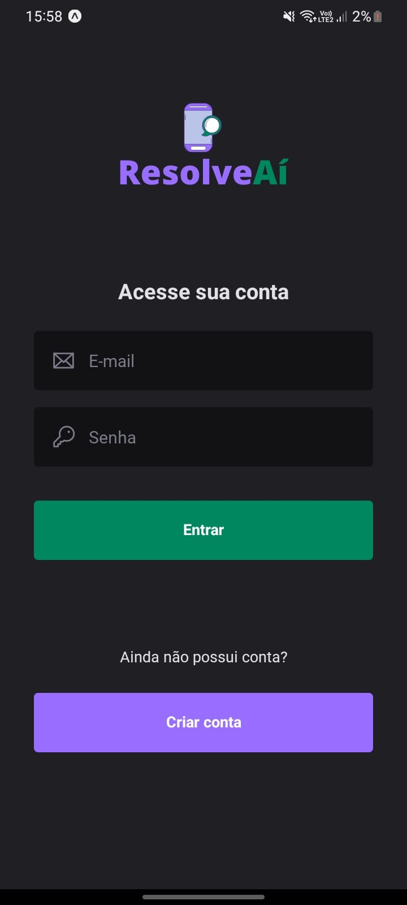
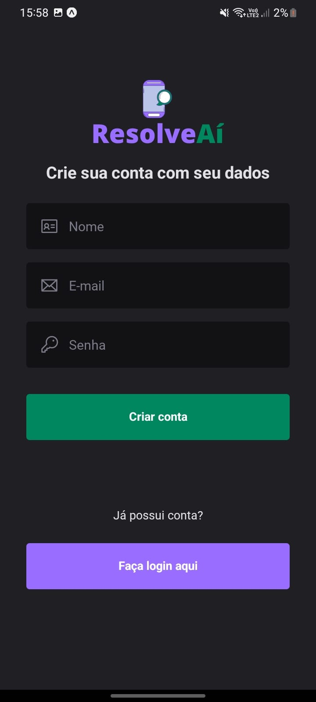
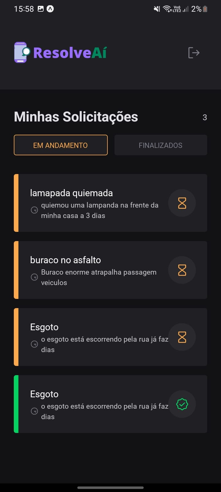

<h1 align="center">
    <a href="#" alt="App mobile ResolveAí"> ResolveAí </a>
</h1>

<h3 align="center">
   Status do Projeto
</h3>

<h4 align="center">
	🚧   Em andamento  🚧
</h4>

## 💻 Sobre o projeto

Com o app ResolveAí pessoas podem ajudar a prefeitura local identificar problemas na cidade.

---

## ⚙️ Funcionalidades

- [ ] O usuário pode se cadastrar com seus dados
- [ ] O usuário pode fazer solitações para resoluções de problemas
- [ ] O usuário pode visualizar a todas as solitações cadastradas

---

### Mobile

<p align="center">
  
  
  
</p>
---

## 🚀 Como executar o projeto

Este projeto é divido em duas partes:

1. [Backend](https://github.com/Rodrigo322/resolveai)
2. Mobile

💡Para o app mobile funcione perfeitamente e necessário que o backend já esteja
executando

### Pré-requisitos

Antes de começar, você vai precisar ter instalado em sua máquina as seguintes ferramentas:
[Git](https://git-scm.com), [Node.js](https://nodejs.org/en/).
Além disto é bom ter um editor para trabalhar com o código como [VSCode](https://code.visualstudio.com/)

#### 🧭 Rodando a aplicação mobile (Frontend)

```bash

# Clone este repositório
$ git clone https://github.com/Rodrigo322/resolveai-mobile.git

# Vá para a pasta da aplicação Front End
$ cd resolveai-mobile

# Instale as dependências
$ npm install ou yarn

# Execute a aplicação em modo de desenvolvimento
$ expo start

```

---

## 🛠 Tecnologias

#### [](https://github.com/Rodrigo322/DevFavorite)**Mobile** ([React Native](http://www.reactnative.com/) + [TypeScript](https://www.typescriptlang.org/))

- **[Expo](https://expo.io/)**
- **[NativeBase](https://nativebase.io/)**
- **[React Navigation](https://reactnavigation.org/)**
- **[Axios](https://github.com/axios/axios)**

## 📝 Licença

Este projeto esta sobe a licença [MIT](./LICENSE).
